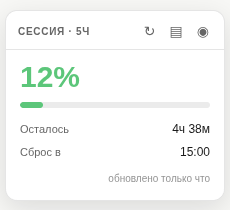
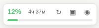
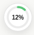
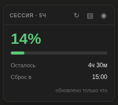

# Claude Session Usage

Расширение для Chrome — показывает прогресс 5-часовой сессии прямо на странице **claude.ai**.

## Режимы отображения

**Полный** — процент, полоска прогресса, время до сброса.

**Компактный** — одна строка: процент и время.

**Точка** — минималистичное кольцо, почти не занимает места.

## Темы оформления

Виджет автоматически подстраивается под тему claude.ai — светлую или тёмную.

## Установка

1. Скачай и распакуй архив
2. Открой Chrome → `chrome://extensions`
3. Включи **«Режим разработчика»** (правый верхний угол)
4. Нажми **«Загрузить распакованное»** → выбери папку расширения
5. Открой `https://claude.ai` — виджет появится в правом нижнем углу

## Что показывает

| Элемент | Описание |
|---------|----------|
| **%** | Сколько лимита 5-часовой сессии потрачено |
| **Полоска** | Зелёная → жёлтая → красная по мере заполнения |
| **Осталось** | Сколько времени до сброса |
| **Сброс в** | Точное время сброса сессии |

## Управление

- **Перетаскивание** — зажми заголовок и тяни в любой угол экрана
- **↻** — обновить данные вручную
- **▣ / ▤ / ◉** — переключение между режимами
- Автообновление каждую минуту, и сразу при возврате на вкладку
